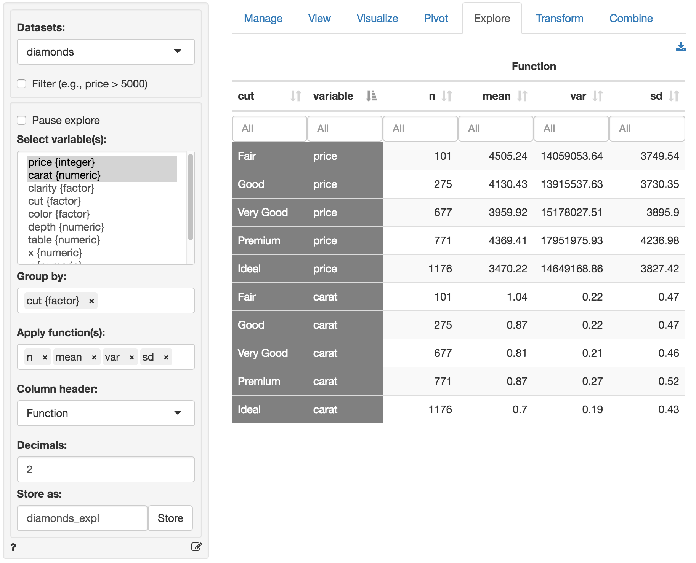

> Summarize and explore your data

Generate summary statistics for one or more variables in your data. The most powerful feature in _Data > Explore_ is that you can easily describe the data _by_ one or more other variables. Where the <a href="https://radiant-rstats.github.io/docs/data/pivot.html" target="_blank">_Data > Pivot_</a> tab works best for frequency tables and to summarize a single numeric variable, the _Data > Explore_ tab allows you to summarize multiple variables at the same time using various statistics.

For example, if we select `price` from the `diamonds` dataset we can see the number of observations (n), the mean, the median, etc. However, the mean price for each clarity level of the diamond can also be easily provided by choosing `clarity` as the `Group by` variable.

> Note that when a categorical variable (`factor`) is selected in `Numeric variable(s)` it is converted to a 0-1 (binary) variable where the first level is coded as 1 and all other levels as 0.

The created summary table can be stored in Radiant by clicking the `Store` button. This can be useful if you want to create plots of the summarized data in <a href="https://radiant-rstats.github.io/docs/data/visualize.html" target="_blank">_Data > Visualize_</a>. To download the table to _csv_ format click the download icon on the top-right.

You can select options from `Column header` dropdown to switch between different column headers. Select either `Function` (e.g., mean, median, etc), `Variable` (e.g., price, carat, etc), or the levels of the (first) `Group by` variable (e.g., Fair-Ideal).

## Functions

Below you will find a brief description of several functions. Most functions, however, will be self-explanatory.

* `n` calculates the number of observations, or rows, in the data or in a group if a `Group by` variable has been selected (`n` uses the `length` function in R)
* `n_distinct` calculates the number of distinct values
* `n_missing` calculates the number of missing values
* `cv` is the coefficient of variation (i.e., mean(x) / sd(x))
* `sd` and `var` calculate the sample standard deviation and variance for numeric data
* `prop` calculates a proportion. For a variable with only values 0 or 1 this is equivalent to `mean`. For other numeric variables it captures the occurence of the maximum value.
For a `factor` it captures the occurence of the first level. 
* `sdprop` and `varprop` calculate the sample standard deviation and variance for a proportion
* `sdpop` and `varpop` calculate the population standard deviation and variance

### Filter

Use the `Filter` box to select (or omit) specific sets of rows from the data. See the helpfile for <a href="https://radiant-rstats.github.io/docs/data/view.html" target="_blank">_Data > View_</a> for details.

### Pause explore

For large datasets it can useful to click `Pause explore` before selecting categorical and numerical variables, entering filters, etc. When you are ready to generate the explore table make sure that `Pause explore` is no longer checked. When `Pause explore` is not checked, any input changes will automatically result in a new table.

### R > Report

Add code to <a href="https://radiant-rstats.github.io/docs/data/report.html" target="_blank">_R > Report_</a> to (re)create the summary table by clicking the <i title="report results" class="fa fa-edit"></i> icon on the bottom left of your screen or by pressing `ALT-enter` on your keyboard.
